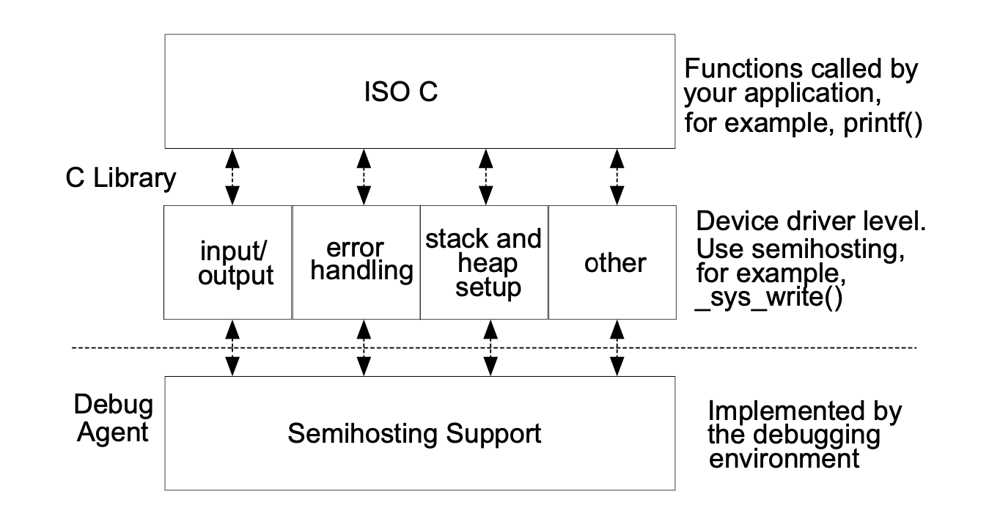
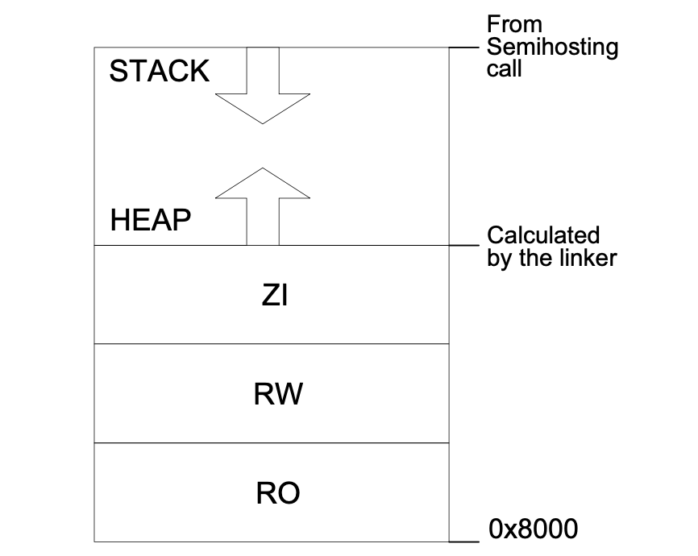

.. _arm_develop:

ARM 编译工具链
========================

关于嵌入式软件开发
~~~~~~~~~~~~~~~~~~~~
大多数嵌入式应用程序最初都是在原生环境中开发的，其资源在内存和处理器能力上与最终产品中的资源不同。
因此，重要的是要考虑将嵌入式应用程序从依赖于开发或调试环境的工具迁移到在目标硬件上独立运行的系统的过程。
使用工具链开发嵌入式软件时，必须考虑以下几点：

- 了解默认的编译工具行为和目标环境，以便您理解从调试或开发版本升级到应用程序的完全独立生产版本所需的步骤。
- 一些C库功能通过使用调试环境资源来执行。如果使用，则必须重新实现此功能以利用目标硬件。
- 工具链没有任何给定目标的内存映射的固有知识。您必须根据目标硬件的内存布局调整映像内存映射。
- 嵌入式应用程序必须先执行一些初始化，例如堆栈和堆初始化，然后才能运行主应用程序。完整的初始化序列除了 `ARM Compiler C` 库初始化例程外，还需要您实现的代码。

.. note::

  简单的可以概括为以下几部分：
    - 定制标准C库函数到目标板
    - 定制IMAGE的存储器映射到目标板
    - 复位和初始化
    - 深层次的存储器器映象考虑
    - 编译和调试IMAGE

默认编译工具行为
~~~~~~~~~~~~~~~~~~~~

当您开始为嵌入式应用程序开发软件时，您可能不知道目标硬件的完整技术规格。例如，您可能不知道目标外围设备，内存映射甚至处理器本身的详细信息。
为了使您能够在不了解此类详细信息之前继续进行软件开发，编译工具具有默认行为，可让您立即开始构建和调试应用程序代码。意识到这种默认行为很有用，
这样您就可以理解从默认构建到完整的独立应用程序所必需的步骤。
在ARM C库中，主机调试环境提供了对某些ISO C功能（例如程序I / O）的支持。提供此功能的机制称为半主机。
当执行半主机时，调试代理会挂起程序执行。然后，调试代理使用主机的调试功能（例如，输出到调试器控制台的printf输出）为半主机操作提供服务，
然后在目标上恢复代码执行。
主机执行的任务对目标上运行的程序是透明的。

C 库结构
~~~~~~~~~~
从概念上讲，C 库可以分为作为 ISO C 标准一部分的函数（例如printf()）和为 ISO C 标准提供支持的函数。
如图显示了通过写入调试器控制台窗口来实现功能 printf() 的C库。 通过调用 _sys_write()（一种执行半主机调用的支持功能）来提供此实现，
从而使用调试器（而不是目标外围设备）获得默认行为。

默认内存映射
~~~~~~~~~~~~~

在未描述内存映射的映像中，链接器根据默认内存映射放置代码和数据，如下图所示：

Nordic 的启动文件
~~~~~~~~~~~~~~~~~~~~~~~~~~~~

启动文件里面有三大部分：

1. 堆栈的初始化
#. 初始化中断向量表
#. Reset_Handler 函数

这里我以 `Nordic` 的 `nrf52840` 的启动文件为例讲解：

因为 `Nordic` 的 SDK 中启动文件是有4种类型的。
有 Keil编译器 、IAR编译器、 SES编译器和直接调用GCC编译 4种。这里会逐个进行讲解。

Keil 编译器调用的是 `arm_startup_nrf52840.s`,
IAR 编译器调用的是 `iar_startup_nrf52840.s`,
SES 编译器调用的是 `ses_startup_nrf52840.s`,
GCC 直接编译调用的是 `gcc_startup_nrf52840.S`.

.. note::
  前面三种启动文件可以通过编译器设置配置。一般工程都是已经配置好了的，如果是自己新建的工程需要自己配置。
  最后 使用GCC 直接编译的方法需要自己在 Makefile 中添加启动文件。
  一般我们看到的 STM32的启动文件基本上几基于 Keil 编译器的。

在讲解启动文件之前，我们需要先了解一下程序的入口地址。
我们都知道通过链接器LD文件设置进程入口地址。方法有以下五种：(排名越靠前，优先级越高)

  1. `ld` 命令行的 -`e` 选项
  #. 链接脚本的ENTRY(SYMBOL)命令
  #. 如果定义了 `start` 符号, 使用 `_start` 符号值
  #. 如果存在 `.text` 段(section), 使用 `.text` 段(section) 的第一字节的位置值
  #. 直接使用数值 `0`

启动文件讲解1 
-------------------

我们先来讲解 基于 Keil 编译器的启动文件

