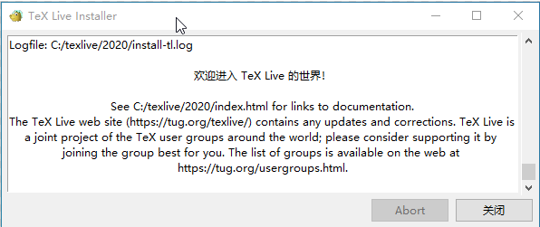

.. _generate_pdf:

生成PDF文件
===============
简单的用一句话概括： 先把 `.rst` 文件转换为 `LateX` 文件，然后使用 `latexpdf` 工具转换成 `PDF` 文件。

Tex 简介
~~~~~~~~~

TeX
--------

`TeX` 是由著名的计算机科学家 `Donald E. Knuth`（高德纳）发明的排版系统，利用 `TeX` 可以很容易地生成高质量的 `dvi` 文件，打印输出。
利用 `dvips`，`dvipdfmx`，`pdfLaTeX`等程序生成 `pdf`，`ps` 文件，`LaTeX2html` 生成 `html` 文件。 它在学术界十分流行，特别是数学、物理学、统计学与计算机科学界。

`TeX` 被普遍认为是一个很好的排版工具，特别是在处理复杂的数学公式时。利用诸如是 `LaTeX` 等终端软件，`TeX` 就能够排版出精美的文本。通过 `CTAN` 上的宏包可以扩展其功能，
可以作幻灯片，定义模板。中文支持可以由 `CCT`、`CJK`、`ctex` 等来完成。

LateX
----------
`LaTeX` 是一种基于 `TeX` 的排版系统，利用这种格式，即使使用者没有排版和程序设计知识也可以充分发挥由 `TeX` 所提供的强大功能，
能在很短的时间内生成很多具有书籍质量的印刷品。对于生成复杂表格和数学公式，这一点表现得尤为突出。
因此它非常适用于生成高印刷质量的完整书籍和学术论文。

所以说，

Tex 作为一种排版系统，它具有很多命令，可让指定的非常详细的文档格式(比如，字体样式，间距，字距，连字等等)，并具有专门的算法来计算文档中的最佳文本流(比如，在何处剪切线，页面等)
所以说， Tex 提供了 强大的算法和命令，可以让你的文档排版的更漂亮更细腻。

Latex 是建立在 Tex 之上的一组宏集，是针对 Tex 的扩展， Tex 聚焦在文档格式，而 Latex 聚焦在文档内容。

Latex 让文档编写人员的精力更多的放在了文档内容上，对于诸如标题、目录、章节之类的设置，可以通过调用 Latex 提供的宏来实现，

这些宏 就是对 Tex 命令的封装。

一句话概括 latex 和 Tex 之间的关系就是：Latex 是 Tex 的一组宏。

使用 Latex 可以不用关心格式，对于实际编写文档的人来说，可以直接使用 Latex 来实现内容。

在 Mac 上使用 TeX 的发行版是 MacTeX ，在 Linux 使用 Tex 的发行版是 TeXLive，在 Window 使用 Tex 的发行版是 MiKTeX, TeXLive, proTeXt。

那么 `.rst` 文件 生成 PDF 文件的过程就是先将 `.rst` 文件(通过 `Sphinx` 的 `make latex` 命令)转换为 LateX 排版的`.tex` 格式的文件，
然后再将 `.tex` 格式文件通过 PDFLateX, XeLaTeX 等排版工具生成 PDF 文件。

Tex Live
~~~~~~~~~~~~~

TeX Live 简介
-------------------

TeX Live 软件发行版为 Unix, Macintosh, Windows 和其他多种平台提供了一套完整的 TeX 系统。
它包含了编辑、排版、预览和打印各种语言下 TeX 文档的各类程序，包括 TeX, LaTeX2e, ConTeXt, Metafont, MetaPost,BibTeX 和许多其他程序的可执行文件,
以及 TeX 宏与字体库的庞大集合。并支持来自世界各地的许多不同文字的排版。
这个发行版还包含了大量 TeX 相关的文档，有面向整个系统的，也有针对具体某个软件包的。

Tex live 相关概念
------------------------

- **Tex Live**
	支持 Window , Linux , Cygwin.
- **MacTeX**
	对于 Mac OS X ，做了一些适配， 重新命名为 MacTex。
- **proTeXt**
	proTeXt对Windows的MiKTeX发行版进行了增强，它向MiKTeX添加了一些额外的工具，并简化了安装。它完全独立于TeX Live。
- **CTAN**
	英文全称是 The Comprehensive TEX Archive Network。 是 Tex 各种资料的档案库，目前有 5899 个软件包。

Tex live 扩展
------------------------
- **e-TeX**
	支持 Window , Linux , Cygwin.
- **pdfTeX**
	对于 Mac OS X ，做了一些适配， 重新命名为 MacTex。
- **LuaTeX**
	proTeXt对Windows的MiKTeX发行版进行了增强，它向MiKTeX添加了一些额外的工具，并简化了安装。它完全独立于TeX Live。
- **XeTeX**

- **Omega (Omega)**

- **Aleph**

.. _about_mac_platform:

安装 Tex 环境
~~~~~~~~~~~~~~

在 :ref:`quickstart` 的基础上，还需要安装Tex 环境。

Mac 平台
-------------------
使用命令安装：

::

    brew cask install mactex

或者通过 `清华大学开源软件镜像站 MacteX 下载链接 <https://mirrors.tuna.tsinghua.edu.cn/CTAN/systems/mac/mactex/MacTeX.pkg>`_ 下载。

Window 平台
--------------------
这里安装的是 TeX Live, TeX Live 的安装方式有两种： 在线安装和离线安装。

.. note::

	更多的内容可以查看 `Tex Live <https://www.latex-project.org/get/>`_ 官网。

1. **在线安装**
	点击 `install -tl-window.exe <http://www.tug.org/texlive/acquire-netinstall.html>`_ 可以直接下载。
	整个下载过程大概在 45 分钟， 如果是 Window10 用户 需要注意使用管理员权限运行。

#. **离线安装**
	离线安装就是下载一个 ISO 镜像文件镜像安装。
	可以在 `Tex Live ISO <http://ftp.math.purdue.edu/mirrors/ctan.org/systems/texlive/Images/>`_ 中，选择合适的版本下载。
	比如选择 `texlive2020.iso`

这里我选择的是 **在线安装** 的方式。

但是需要注意的是:检查是否配置了环境变量。
在 系统属性-> 高级-> 环境变量 -> 系统变量 中查看 PATH 变量。

比如我的安装路径是 `C:/texlive\2018\bin\win32` 。 如果 PATH 变量没有类似的配置，需要自行添加。

.. note::

	使用 Win + R -> cmd 启动 cmd.exe 输入 set path=test_path 。 然后退出DOS 窗口重新进入之后，输入 echo %PATH% 即可查看配置
	是否生效。这个办法可以有效达到 Window 不重启，使环境变量修改生效的作用。

Latex 输出选项
~~~~~~~~~~~~~~

对于 `Latex` 的输出选项设置都是通过修改 `conf.py` 文件来完成的。
在 `Latex` 的输出选项中，我们常用的变量有 `latex_elements` , `latex_engine` , `latex_documents` 等。

.. note::

    更多的内容可以查看 `Latex <https://www.sphinx-doc.org/en/master/latex.html>`_ 的官网说明。

.. _latex_elements:

1. **latex_elements**

    变量 `latex_elements` 主要用来设置自定义的界面。

    配置参数是以 `python` 的字典形式存在的。所以，字典的 `key` 是不可以修改的，只可以修改 `value` 。

    常用的 `key` 说明如下：

    ============== =================================================
    papersize      文件类的纸张尺寸选项('a4paper' 或 'letterpaper'),
                   默认为 'letterpaper' .
    pointsize      文档类的点大小选项('10pt', '11pt' 或 '12pt'),
                   默认为 '10pt'.
    preamble       附加前导内容,默认为空.可以将所有需要的宏移动到某个文件
    babel          “babel” 包包含,默认 '\\ usepackage {babel}'
                   (合适的文档语言字符串作为类选项传递,如果没有语言则使用
                   `english` .)对于日语文件,默认是空字符串.
    ============== =================================================

    这里我使用的配置如下：

    ::

        latex_elements = {
            'papersize': 'a4paper',
            # Additional stuff for the LaTeX preamble.
            'preamble': r'''
            \usepackage{xeCJK}
            \usepackage{indentfirst}
            \setlength{\parindent}{2em}
            \setCJKmainfont[BoldFont=STFangsong, ItalicFont=STKaiti]{STSong}
            \setCJKsansfont[BoldFont=STHeiti]{STXihei}
            \setCJKmonofont{STFangsong}
            ''',
            }

#. **latex_engine**
    用于构建文档的LaTeX引擎(排版工具)。该设置可以具有以下值:

    * ``'pdflatex'`` – PDFLaTeX (default)
    * ``'xelatex'`` – XeLaTeX
    * ``'lualatex'`` – LuaLaTeX
    * ``'platex'`` – pLaTeX (如果 language 为 ``'ja'`` 则为默认值)

    这里我使用的配置如下：

    ::

        latex_engine = 'xelatex'

#. **latex_documents**

    此值确定如何将文档树分组为 LaTeX 源文件。它必须是元组列表 (startdocname, targetname, title, author, documentclass, toctree_only).

    *startdocname*
     用于指定 LaTeX 文件主文档的 `document name` 的字符串。 `TOC` 树中 `startdoc` 文档引用的所有文档都将包含在 `LaTeX` 文件中。
     (如果要使用 `LaTeX` 构建的默认主文档, 这里默认配置为 ``'index'``。如果你使用的还是 Sphinx 2.0 版本之前的 则配置为 ``'contents'``。)

    *targetname*
     输出目录中LaTeX文件的文件名。

    *title*
     LaTeX文档标题。可以为空以使用 `startdoc` 文档的标题。这是作为LaTeX标记插入的, 因此如果要按字面插入,
     必须使用正确的LaTeX命令来表示反斜杠或符号等特殊字符。

    *author*
     LaTeX文档的作者。相同的LaTeX标记警告 标题 适用。使用 \\and 来分隔多个作者,
     例如: 'John \\and Sarah' (反斜杠必须由Python转义才能到达LaTeX)。

    *theme*
     LaTeX输出应使用的“主题”。它是LaTeX输出设置的集合（例如，文档类，顶级切片单元等）。
     作为内置的LaTeX主题，manual并howto捆绑在一起。

     *manual*
       用于编写手册的LaTeX主题。导入report文档类（日语文档使用jsbook）。

     *howto*
       用于撰写文章的LaTeX主题。导入article文档类（使用日语文档jreport）。

     默认为'manual' 。

    *toctree_only*
     必须是 True 或 False 。如果为true, 则 startdoc 文档本身不包含在输出中, 只包含通过TOC树引用的文档。
     使用此选项, 您可以在主文档中添加额外的内容, 这些内容显示在HTML中, 而不是LaTeX输出中。

    这里我使用的配置如下：

    ::

        latex_documents = [
            ('index', 'How_To_Build_Doc.tex', 'How To Build Doc',
            'author: Michael Miao', 'manual', True),
        ]

执行命令
~~~~~~~~~~~~~~

Mac 平台
-------------------

::
    make latexpdf

.. note::

    `make latexpdf` 这个命令可以拆解为以下两个步骤： 生成 `.tex` 文件， 使用 `xelatex` 工具将 `.tex` 文件转换成 `PDF` 文件.
     也可以执行以下命令,效果是一样的。

    ::

        make latex
        cd build/latex
        make

最后生成的 `PDF` 文件在 `build/latex` 目录下。

Window 平台
--------------------

