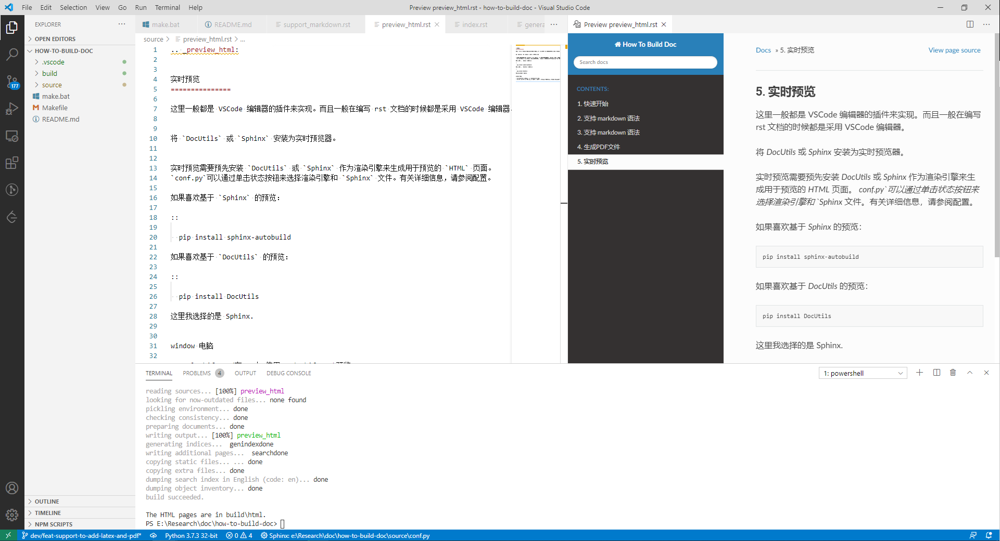
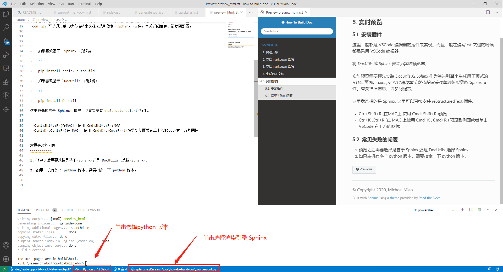

.. _preview_html:

实时预览
===============

安装插件
~~~~~~~~~

这里一般都是 VSCode 编辑器的插件来实现。而且一般在编写 rst 文档的时候都是采用 VSCode 编辑器。

将 `DocUtils` 或 `Sphinx` 安装为实时预览器。

实时预览需要预先安装 `DocUtils` 或 `Sphinx` 作为渲染引擎来生成用于预览的 `HTML` 页面。
`conf.py` 可以通过单击状态按钮来选择渲染引擎和 `Sphinx` 文件。有关详细信息，请参阅配置。

..
	如果喜欢基于 `Sphinx` 的预览：

	::

	pip install sphinx-autobuild

	如果喜欢基于 `DocUtils` 的预览：

	::

	pip install DocUtils

这里我选择的是 Sphinx. 这里可以直接安装 reStructuredText 插件。

- Ctrl+Shift+R (在MAC上 使用 Cmd+Shift+R )预览
- Ctrl+K ,Ctrl+R (在 MAC 上使用 Cmd+K , Cmd+R  ) 预览到侧面或者单击 VSCode 右上方的图标

常见失败的问题
~~~~~~~~~~~~~~~~

1. 预览之后需要选择是基于 Sphinx 还是 DocUtils ,选择 Sphinx .

2. 如果主机有多个 python 版本，需要指定一下 python 版本。

3. 可以预览图图片但是不能预览视频。

