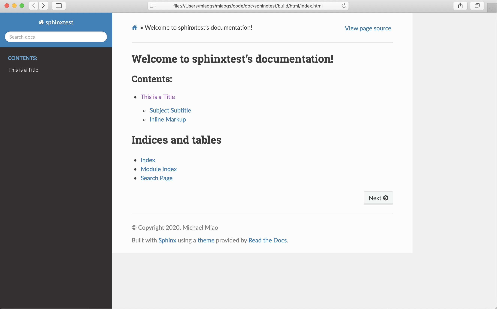
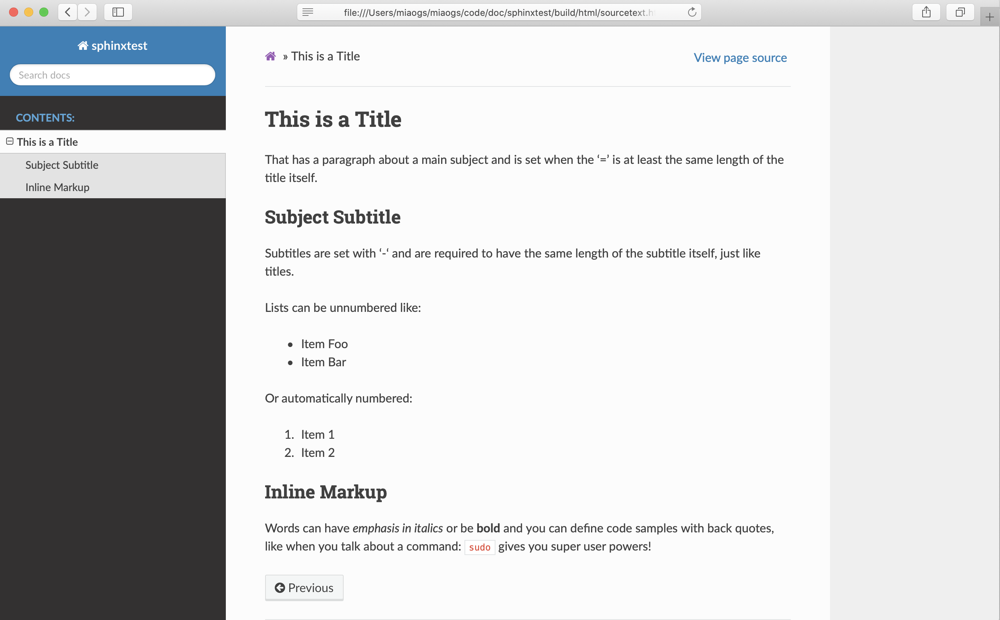

.. _quickstart:

快速开始
=========

.. _install_sphinx_env:

安装sphinx环境
~~~~~~~~~~~~~~

这里我是基于 `python3.7` .

.. note::

    如果网速不加的话，大家可以使用python的镜像源，比如豆瓣的：

    :: 

        https://pypi.douban.com/simple

.. _install_sphinx:

使用命令安装 sphinx 
-------------------
:: 

    pip install sphinx
    # pip install sphinx -i https://pypi.douban.com/simple

.. _install_sphinx_html_theme:

安装 Read The Docs 主题
-----------------------

`Read The Docs` 主题是一个很流行的 `Sphinx` 主题，也是本文档使用的主题，它特别适合用来写文档。
也可以不安装 使用 `sphinx` 默认的主题。

::

    pip install sphinx_rtd_theme

.. _build_sphinx_project:

创建一个简单的 `Sphinx` 工程
~~~~~~~~~~~~~~~~~~~~~~~~~~~~~~~~~

.. _create_sphinx_project:

创建工程
---------

::

    mkdir sphinxtest
    cd sphinxtest
    sphinx-quickstart
    config .

在输入 `sphinx-quickstart` 之后，需要根据对话框提示填入基本内容才可以完成工程的创建。 目录中就会有一些初始内容。

常见的配置如下：
1. 设置文档的根路径（回车，使用默认设置）
2. 是否分离source和build目录（输入y,选择分离，方便管理）
3. 设定模板前缀（回车，使用默认选项）
4. 输入项目名称和作者
5. 输入项目版本号
6. 文档语言（回车，默认即可）

::

    [~/miaogs/code/doc/sphinxtest]:~$ sphinx-quickstart
    Welcome to the Sphinx 3.2.1 quickstart utility.

    Please enter values for the following settings (just press Enter to
    accept a default value, if one is given in brackets).

    Selected root path: .

    You have two options for placing the build directory for Sphinx output.
    Either, you use a directory "_build" within the root path, or you separate
    "source" and "build" directories within the root path.
    > Separate source and build directories (y/n) [n]: y

    The project name will occur in several places in the built documentation.
    > Project name: sphinxtest
    > Author name(s): Michael Miao
    > Project release []:

    If the documents are to be written in a language other than English,
    you can select a language here by its language code. Sphinx will then
    translate text that it generates into that language.

    For a list of supported codes, see
    https://www.sphinx-doc.org/en/master/usage/configuration.html#confval-language.
    > Project language [en]:

    Creating file /Users/miaogs/miaogs/code/doc/sphinxtest/source/conf.py.
    Creating file /Users/miaogs/miaogs/code/doc/sphinxtest/source/index.rst.
    Creating file /Users/miaogs/miaogs/code/doc/sphinxtest/Makefile.
    Creating file /Users/miaogs/miaogs/code/doc/sphinxtest/make.bat.

    Finished: An initial directory structure has been created.

    You should now populate your master file /Users/miaogs/miaogs/code/doc/sphinxtest/source/index.rst and create other documentation
    source files. Use the Makefile to build the docs, like so:
    make builder
    where "builder" is one of the supported builders, e.g. html, latex or linkcheck.

    [~/miaogs/code/doc/sphinxtest]:~$

.. _project_brief:

工程简介
----------

项目创建之后，默认的工程目录结构如下：

:: 

    .
    ├── Makefile
    ├── make.bat
    └── source
        ├── _static
        ├── _templates
        ├── conf.py
        ├── index.rst
        └── sourcetext.rst

    3 directories, 5 files

1. **工程文件介绍**

    =========== ==========================================================
    Files       Notes
    =========== ==========================================================
    build       用来存放通过 `make html` 生成文档网页文件的目录
    source      存放用于生成文档的源文件
    conf.py     `Sphinx` 的配置文件,更多的内容可以查看 `Sphinx Configuration <https://www.sphinx-doc.org/en/master/usage/configuration.html>`_ 的官网说明。
    index.rst   主文档定义文档结构
    =========== ==========================================================

#. **主文档index.rst**

    主文档 `index.rst` 的主要功能是被转换成欢迎页, 默认包含一个目录表（ `table of contents tree` 或者 `toctree` ).
    而 `Sphinx` 支持 `reStructuredText` 语法, 可以把许多 `.rst` 文件组织成一份结构合理的 `html` 或者 `PDF` 形式的文档.

    `toctree` 指令初始值如下：

    ::

        .. toctree::
        :maxdepth: 2

    你可以在 `content` 的位置添加文档列表:

    比如，以后面我要添加的 `sourcetext.rst` 文件举例：

    ::

        .. toctree::
            :maxdepth: 2
            :caption: Contents:

            sourcetext

    .. note::

        需要特别注意的是新增的文档文件放在与 `index.rst` 同级目录下。

        更多的关于 `sphinx` 的说明大家可以查看 `Sphinx 英文官网 <https://www.sphinx-doc.org/en/master/>`_ 的 `contents <https://www.sphinx-doc.org/en/master/contents.html>`_ 部分。

        或者 `Sphinx 中文官网 <https://www.sphinx.org.cn/>`_ 的 `目录 <https://www.sphinx.org.cn/contents.html>`_ 部分。

.. _generate_html_doc:

尝试生成HTML文档
-----------------------

1. **添加一个简单的文本**

    在 `source` 文件夹的统计目录下，创建一个名为 `sourcetest.rst` 文件。并在 `sourcetest.rst` 文件中添加一下内容：

    ::

        This is a Title
        ===============
        That has a paragraph about a main subject and is set when the '='
        is at least the same length of the title itself.
        
        Subject Subtitle
        ----------------
        Subtitles are set with '-' and are required to have the same length 
        of the subtitle itself, just like titles.
        
        Lists can be unnumbered like:
        
        * Item Foo
        * Item Bar
        
        Or automatically numbered:
        
        #. Item 1
        #. Item 2
        
        Inline Markup
        -------------
        Words can have *emphasis in italics* or be **bold** and you can define
        code samples with back quotes, like when you talk about a command: ``sudo`` 
        gives you super user powers!

#. **使用命令**

    在 `Linux` 和 `Mac` 平台下，我们可以执行 `make html`;
    在 `Window` 平台下，我们可以执行 `make.bat`.

    执行 make html 命令之后效果如下：

    ::

        [miaogs/code/doc/sphinxtest:]~$ make html
        正在运行 Sphinx v3.2.1
        创建输出目录... 完成
        构建 [mo]： 0 个 po 文件的目标文件已过期
        构建 [html]： 2 个源文件的目标文件已过期
        更新环境: [新配置] 已添加 2，0 已更改，0 已移除
        阅读源... [ 50%] index                                                                                                                                   阅读源... [100%] sourcetext                                                                                                                                 
        查找当前已过期的文件... 没有找到
        pickling环境... 完成
        检查一致性... 完成
        准备文件... 完成
        写入输出... [ 50%] index                                                                                                                                 写入输出... [100%] sourcetext                                                                                                                                
        generating indices...  genindex完成
        writing additional pages...  search完成
        复制静态文件... ... 完成
        copying extra files... 完成
        dumping search index in English (code: en)... 完成
        dumping object inventory... 完成
        构建 成功.

        HTML 页面保存在 build/html 目录。
        [miaogs/code/doc/sphinxtest:]~$

    当然了，如果你查看 `Makefile` 或者 `make.bat` 就会发现，其实他们都是执行了以下这个命令

    ::

        sphinx-build -b <builder> <source> <destination>

    参数说明如下：

    ================= =============================================================
    `<builder>`       是使用的 `Builder` 名称，如 `html`、`latex`等。这里我们使用默认的
                      `HTML Builder`，就可以省略 `-b` 参数了。

    `<source>`        是源文件夹，也就是我们的源文件所放置在的文件夹。在这里就是当前目录
                      `./source`。

    `<destination>`   是目标文件夹，也就是被生成的文档应该被放到的地方。这里我们放到 `build`
                      里面。
    ================= =============================================================

    所以，这里我们也可以统一执行命令: ``sphinx-build ./source build`` 。执行命令的效果如下：

    ::

        [miaogs/code/doc/sphinxtest:]~$ sphinx-build ./source build                                                    
        正在运行 Sphinx v3.2.1
        构建 [mo]： 0 个 po 文件的目标文件已过期
        构建 [html]： 2 个源文件的目标文件已过期
        更新环境: [新配置] 已添加 2，0 已更改，0 已移除
        阅读源... [ 50%] index                                                                                                                                   阅读源... [100%] sourcetext                                                                                                                                 
        查找当前已过期的文件... 没有找到
        pickling环境... 完成
        检查一致性... 完成
        准备文件... 完成
        写入输出... [ 50%] index                                                                                                                                 写入输出... [100%] sourcetext                                                                                                                                
        generating indices...  genindex完成
        writing additional pages...  search完成
        复制静态文件... ... 完成
        copying extra files... 完成
        dumping search index in English (code: en)... 完成
        dumping object inventory... 完成
        构建 成功.

        HTML 页面保存在 build 目录
        [miaogs/code/doc/sphinxtest:]~$

#. **查看效果**

    我们在 `build/html` 目录下，双击打开 `index.html` 文件。

    .. image:: _static/image/sphinxtest_default_theme_1.png

    再单击 **This is a Title**

    .. image:: _static/image/sphinxtest_default_theme_2.png

    可以看出，效果是一样的。

.. _change_html_theme:

更换HTML主题
-----------------

如果你在 :ref:`install_sphinx_env` 中，选择了 :ref:`install_sphinx_html_theme` ,那么我们可以尝试更换一下 `html` 主题。

在 `conf.py` 文件中添加以下代码：

::

    import sphinx_rtd_theme #import theme

    extensions = [
    "sphinx_rtd_theme"
    ]

    html_theme = 'sphinx_rtd_theme'

然后删除 `build` 文件夹，执行 `make html` 命令，新的 `html` 文档界面如下：

单击 **This is a Title**

.. note::

    更多的内容可以查看 `html theme <https://www.sphinx-doc.org/en/master/usage/theming.html>`_ 的官网说明。