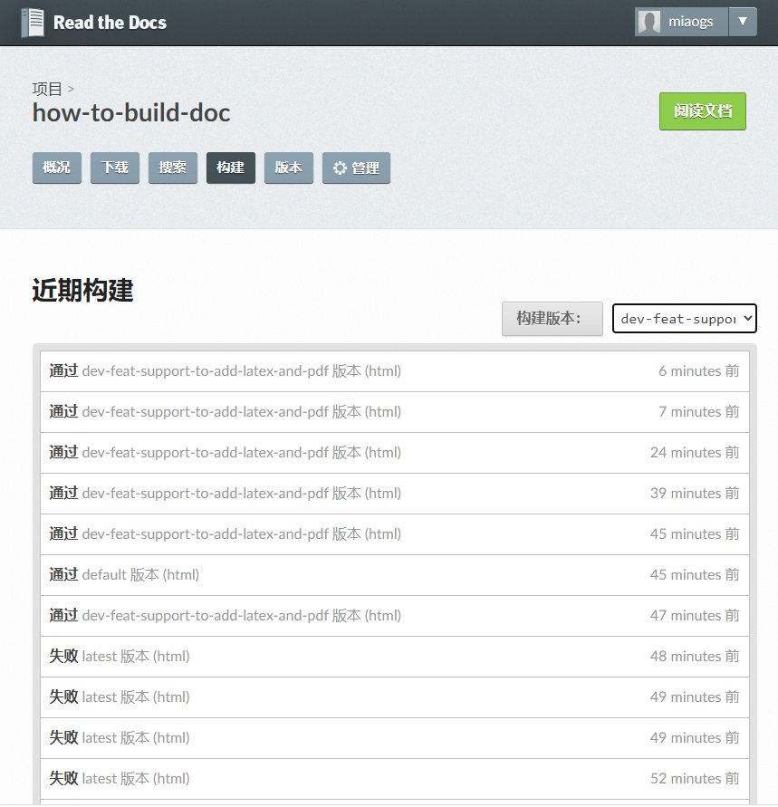
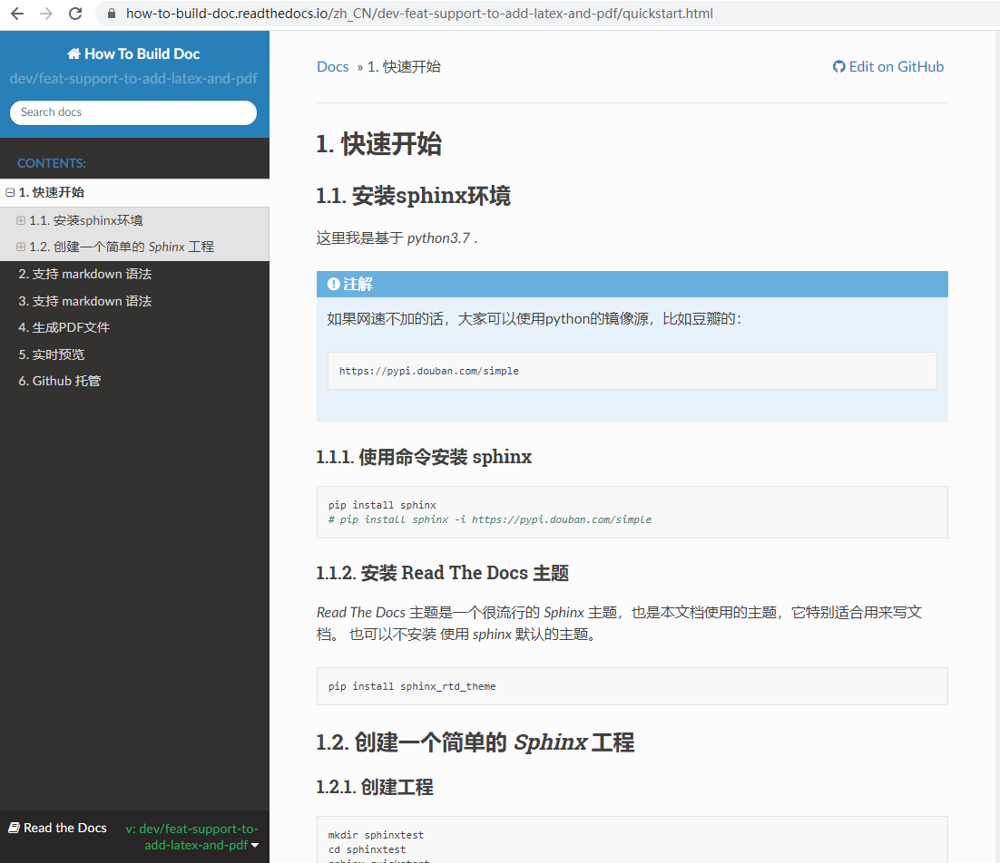

.. _read_the_doc:

Github 托管
===============

如果是要写一个系列的技术大文章。不是单纯的 一两篇内容的话。我比较推荐使用 Sphinx + GitHub + ReadtheDocs 这个组合。

采用 Sphinx 写文档 然后放在 github 上，借用 Github 托管文档到 Read the Docs。

Read the Docs 是一个在线文档托管系统， 可以支持从 Git,SVN 等版本控制系统中导入文档 ，使用 Github 上的 webhooks，

可以做到每次提交代码后可以自动构建并上传至readthedocs网站。

非常省心方便。

使用步骤
~~~~~~~~~~~~

这里大家可以参考 `Read the Docs <https://github.com/rtfd/readthedocs.org>`_ 官网。

这里我简单的描述一下步骤：

1. 在 Read the Docs 上面注册一个账号，关联到Github.(这里我使用的是 Github ,当然你也可以使用 GitLab 之类的)
2. 然后选择 “Import”，选择关联的 GIthub 仓库。
3. 可以使用默认配置，或者自己的需求修改配置，比如设置语言。

  .. figure:: ./figures/choose-git.png
    :alt: 项目配置
    :align: center

4. 完成之后，每次你push 代码之后，Read the Docs 都会自动更新。
5. 也可以指定需要构建的分支或者版本。

构建文档

在线文档

