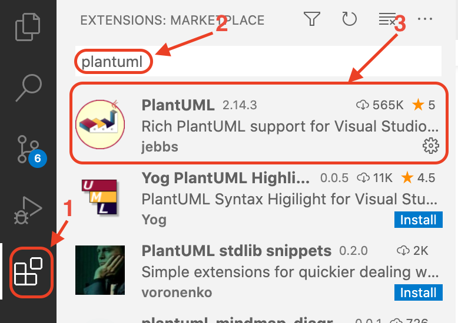
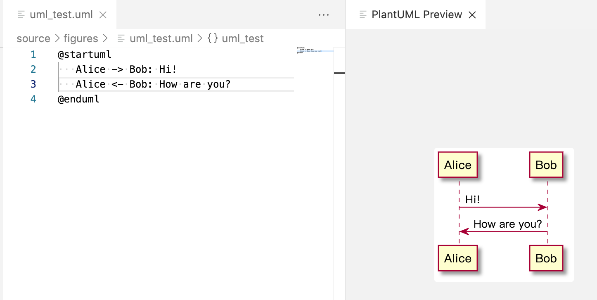

.. _support_plantuml:

支持 uml 语法
======================

UML 是流行的图解符号。可以用来画标准图，对象图，组件图，交互图，状态图，活动图等等。

`Sphinx` 本身也是支持 `UML` ，和前两章一样，需要添加第三方库，这里我们使用 `sphinxcontrib-plantuml <https://pypi.org/project/sphinxcontrib-plantuml/>`_ 进行转换。


.. _install_uml_env:

安装支持 UML 环境
~~~~~~~~~~~~~~~~~~~

`PlantUML` 渲染需要安装以下组件：

- `JAVA <http://java.com/en/download/>`_ : `PlantUML` 运行的平台. 可以先用命令 `java -version` 查看是否安装。
- `Graphviz <http://www.graphviz.org/download/>`_ : `PlantUML` 用 `Graphviz` 来计算图中的位置.


一般而言，如果我们不是从事 `JAVA` 开发，可不不需要安装 `JDK(Java Development Kit)`, 只需要安装 `JRE(Java Runtime Enviroment)` 即可。
除了可以在 `JRE` 官网下载安装之外，`MAC` 平台可以直接使用 `brew install  --cask adoptopenjdk` 安装. 


`Graphviz <http://www.graphviz.org/download/>`_ 可以直接打开官网直接下载安装， `MAC` 平台可以直接使用 `brew install graphviz` 安装。 


.. _install_uml_plantuml:

基于 Sphinx 的 UML 使用 
~~~~~~~~~~~~~~~~~~~~~~~~~~~

安装 Sphinx 扩展以及依赖
--------------------------------

安装 Sphinx 扩展。

::

    pip install sphinxcontrib-plantuml

下载 `plantuml.jar <https://sourceforge.net/projects/plantuml/>`_ ，可以用来运行各种 `PlantUML` 命令。
这里需要注意一下 `plantuml.jar` 的存放的路径。


修改 conf.py
--------------------------------

在文档的 `conf.py` 中添加 `extension` 和 `plantuml` 调用指令

1. **增加扩展**

    ::

        extensions = ['sphinxcontrib.plantuml']


    结合 ，修改之后变为

    ::

        extensions = [
        'sphinx_rtd_theme',
        'recommonmark',
        'sphinxcontrib.plantuml'
        ]

2. **增加 plantuml 调用指令**

`/Users/gmiao/tools/plantuml.jar` 是 `plantuml.jar` 的位置目录。

    ::

        import sys

        .
        .
        .

        # Specify plantuml command in your conf.py
        if sys.platform == 'darwin':# MAC platform
        plantuml = 'java -jar /Users/gmiao/tools/plantuml.jar'


结合 VScode 的 UML 使用
~~~~~~~~~~~~~~~~~~~~~~~~~~~

首先可以直接参考:ref:`install_uml_env`，也可以参考 `plantuml官网 <https://plantuml.com/zh/download>`_ 

最后，安装 `VScode` 的插件窗口里面直接搜索 `PlantUML` 插件安装。




如何使用
~~~~~~~~~~~

在 `figures` 目录下新建一个 `uml_test.uml`

文件内容如下：

::

    @startuml
    Alice -> Bob: Hi!
    Alice <- Bob: How are you?
    @enduml


- 直接使用快捷键 `ALT+D` (MAC：使用 `option+D` ) 预览。
- 使用 `CTRL+Shift+P` 打开命令面板，找到 `Export Current Diagram` 命令导出. 支持 `.png`, `.svg`, `.html`, `.pdf`, `.latex` 等多种格式导出。





在 `.rst` 添加这个 `uml_test.uml` 需要指定相对路径：

::
 
    .. uml:: figures/uml_test.uml
      :scale: 50%
      :width: 80%
      :align: center
      :caption: PlantUML 

亦可以在 `.rst` 文件中直接添加 `UML`,比如在当前章节添加以下内容：

::

  .. uml::

    Alice -> Bob: Hi!
    Alice <- Bob: How are you?

可以看到如下输出：

.. uml::

   Alice -> Bob: Hi!
   Alice <- Bob: How are you?


`Markdown` 文件中添加 `UML` 的例子。

::
  
  ```plantuml
    @startuml
   Alice -> Bob: Hi!
   Alice <- Bob: How are you?
    @enduml
  ```

.. note::

  更多关于 PlantUML 插件可以查看 `官方说明 <https://marketplace.visualstudio.com/items?itemName=jebbs.plantuml>`_
